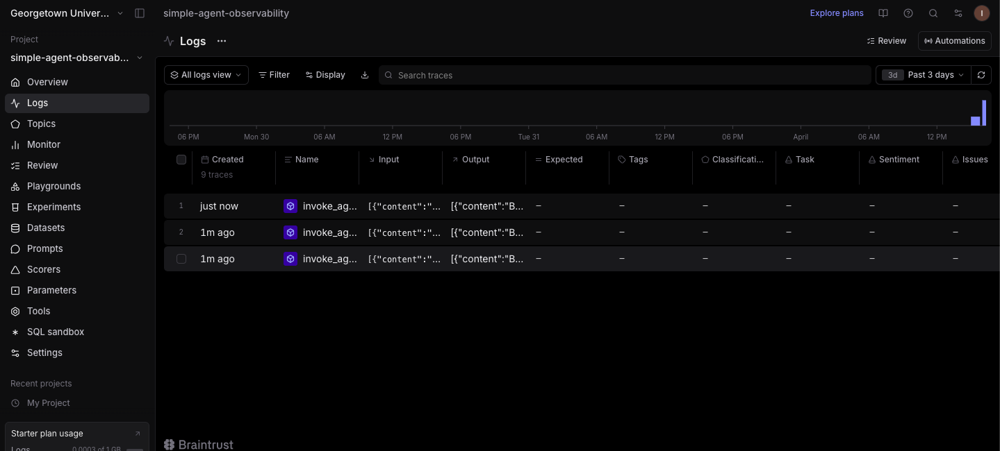
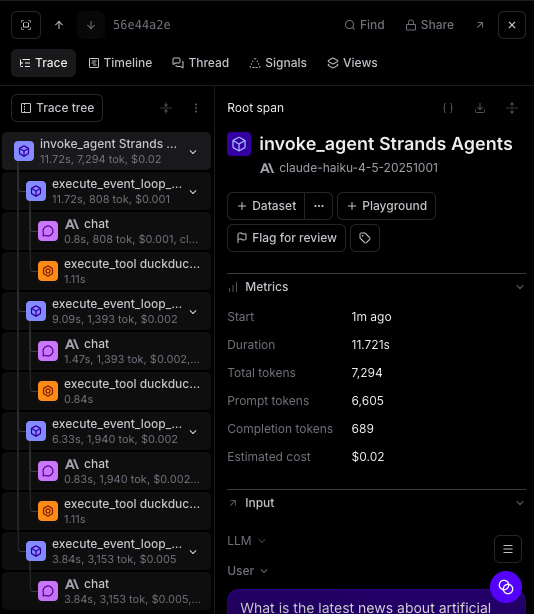
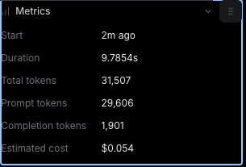

## Analysis

From my understanding, each user query creates a different trace, inside each trace there are mutliple spans. Spans contain tool usage and model calls, for example in this isntance it is DuckDuckGo. Each user query is a trace which is the whole requests and the spans are the steps within. 

In the metrics view, I noticed more details within the process. For example, some queries take longer because they trigger tool usage, and some tools need longer to run. For example latency is different between different tools, using DuckDuckGo prompts a longer query process. Another interesting I found, is that tool based queries take more tokens. 

I enjoyed learning about when a model decides to use a tool, which was easy to see using Braintrust. 

Traces for different queries

 

Model Call and tool usage

Token Usage and Latency
